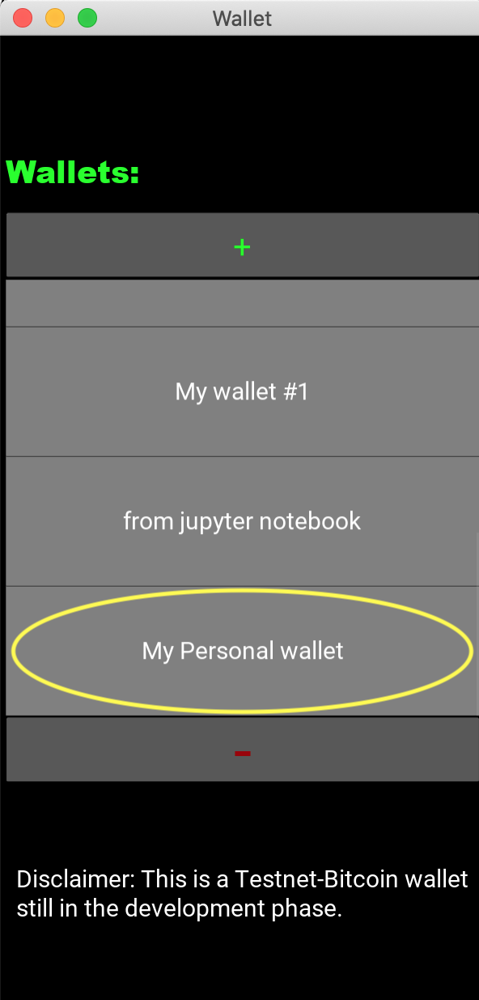

# blockchain

This project is still in development. 

### Description:

The blockchain project is mostly an educational-purpose project which aims to develop wallets for the retail industry supporting some well-known cryptocurrencies. This wallet is built completely from scratch (no external libraries except for python built-in libraries) implementing the mechanics behind blockchain and crytocurrencies. The few libraries used, are mostly front-end libraries which are necessary -but not the most relevant- to exploit to the real meat of this project which is mostly the guts themselves of the crypto world.

### Status:

#### V 0.1

Currently only supporting Testnet Bitcoin for individuals. The corporate version coming soon...

### Achievments:

-Elliptic Curve Cryptography (secp256k1)

-Transactions

-Bip32

-Bip39

-Accounts

-Segwit Compliant

-Multi-signature

Some of the code here comes from the book Programming Bitcoin, so a share of the credit goes to Jimmy Song (the author of the great book).

### General Description of Current Version

The current version of the wallet is a wallet for the testnet network. It is intended for individual use, however a company version is on its way. The general features will be discussed next:

#### Security:

 - This Wallet is not a cloud-based wallet since this is considered a major security hazard.

 - All keys are stored locally in the device in an SQLite database. 

 - Recovery function (coming soon) will be available following BIP44, BIP32 standard for addresses creation, and BIP39 mnemonic phrase.

 #### Privacy:

 - No address will be used more than once (BIP32/BIP44 standard).

 #### Technology:

- Multi-signature technology is available, although not fully exploited yet. Only used for making SegWit addresses backward compatible (P2SH_P2WPKH). Fully multi-signature wallets will come in next versions.

- Segregated Witness technology is supported with the exception of multi-signature SegWit addresses (P2WSH, P2SH_P2WSH). This will be available in the coming versions.

### External APIs

- Block-Cypher: This wallet is using Block-Cypher's API to get and push information to the blockchain.

- Crypto-Compare: This wallet uses crypto-compare's API to get the price in real time for Bitcoin.


### How to use:

This library uses Kivy for its front-end development. A release with executables for different platforms (iOS, Android, Mac, Windows) is on its way. But for right now, to use this app, follow the following steps (I suggest you to do this in a brand-new virtual environment):

1. Clone this repository.
2. Install dependencies:
    - kivy
    - blockcypher
    - pyperclip
    - qrcode
3. Run:

     ```$ cd blockchain```

    ```$ python3 bitcoin/basics/final/main.py ```


Once there, you will have your wallet running on the wallet-selection screen (you might see an empty list of wallets):


 


Press the "+" button to create a Wallet. A popup window will prompt to name your new wallet:


Once you have named your wallet, you will be able to see it in your wallets list. 



Click the wallet to access to it. You will go to the "Main" screen of your selected Wallet. Here, you can see your balance, and you can choose to send or receive testnet bitcoins:


Let's receive some Bitcoin! press the "RECEIVE" button:


You can choose to use an unused address, or to create a new one. Let's try the former. Press the spinner under the label "From an unused address". You can choose between P2PKH, P2WPKH and P2SH (multi-signature) address. P2PKH is the default:


But, of course, we have no unused addresses yet.


 So let's create a new one. Select any type of address under the label "From a new address":


 Now, let's see the address and its QR code. Simply press the "Show QR code" button:


 You can simply tap on the address to get it copied to the clipboard. Press "OK" to go back.

 Now let's try to send some Testnet Bitcoins. Press the "GO BACK" button to go to the main screen. Now, press "SEND":


 You can paste an address in the text-input field by double-tapping on it, or you can scan a QR code. Let's do the latter. Press the QR code button. A camera popup will prompt. Place the QR code of the address to which you wish to send Testnet Bitcoins to in front of the camera:


 Once the address is shown below the camera, press "SELECT THIS ADDRESS". This will take you back to the "Send" screen with the address scanned in the text-input field:


 You can now introduce the amount you wish to send to that address. You can select Bitcoins or Satoshis by pressing the spinner under "Units":


 Bitcoins is the default unit. Let's send 10.000 Satoshis (or 0.0001 BTC): 

 

 A confirmation window will pop up. If this information is correct, press "YES":


 Wait a second! We still don't have any money:


 Let's receive some testnet money from a Bitcoin Faucet through the address we created previously. Then let's manually update our balance by clicking the update-balance icon  located in the top-right corner of the "Main" screen of the wallet.


 The wallet will prompt some messages while retrieving the information from the blockchain and writing it into the local database. Then your balance will be displayed:


 To select, create or delete a wallet, simply hit the   button to go back to the "Wallet-Selection" screen. 

More functions like multi-signature wallets, Wallet recovery, Wallet backup, and corporate accounts will be included in the following versions.